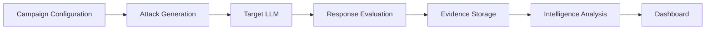
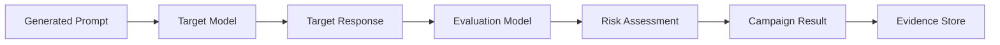
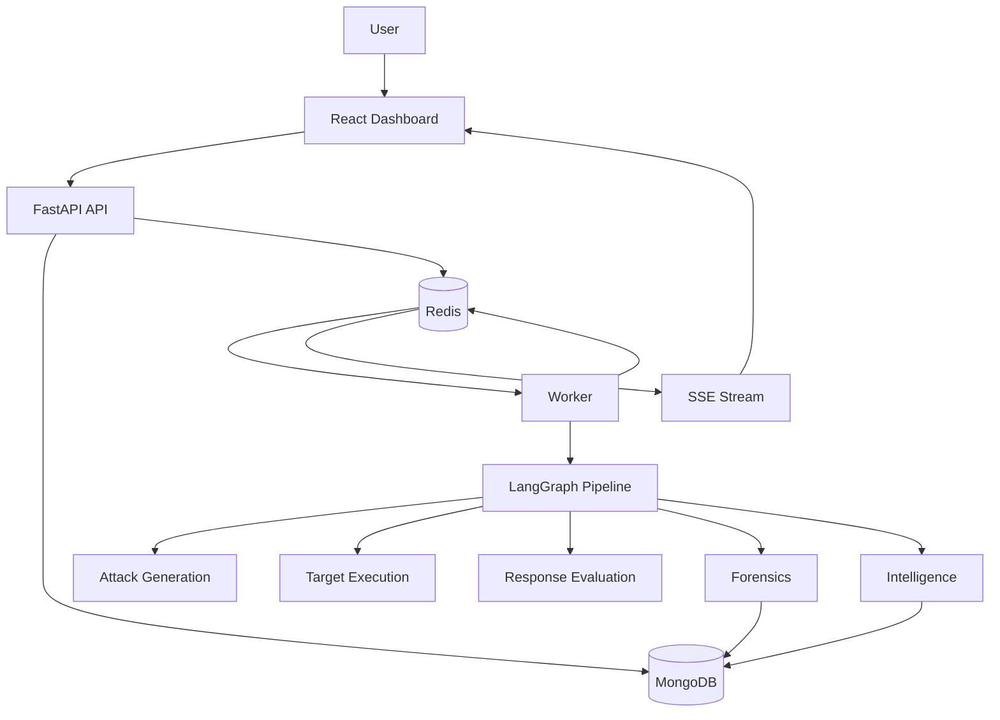
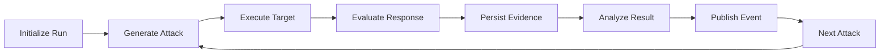
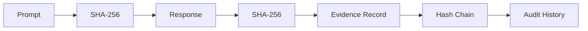
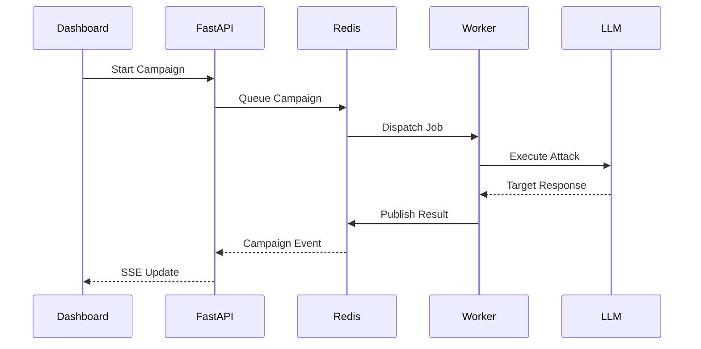

<div align="center">

<pre>
  
⣠⢠⡤⡤⠠⢤⢠⡀⡀⠀⠀⠒⡀⠀⡀⠒⠀⠀⠀⣀⣠⠄⠠⣄⣀⣤⡄
⠈⠳⣿⡤⠤⡏⠀⠉⠙⠰⣄⠀⢰⢠⠃⢀⡤⠎⠋⠉⠀⢹⠤⢼⣭⠍⠀
⠀⠀⠐⢷⡅⠑⢒⡤⠤⠀⡈⠠⢀⣌⡰⠉⡀⠀⠠⢄⡒⠓⢨⣿⠂⠀⠀
⠀⠀⠀⠱⣶⣯⣐⢴⣀⣀⢤⡥⢾⣯⠥⢥⠤⣀⢀⢚⢀⣹⡿⠃⠀⠀⠀
⠀⠀⠀⠀⠈⢘⣥⠝⠀⢁⠔⡠⠺⡶⡄⢐⠀⡀⠐⠱⣞⠃⠀⠀⠀⠀⠀
⠀⠀⠀⠀⠀⢼⡅⢤⠴⢅⠔⢰⠁⠀⢙⡌⠀⡀⠆⠠⡽⡇⠀⠀⠀⠀⠀
⠀⠀⠀⠀⠀⠘⣿⣇⡬⡌⢀⡟⠀⠀⠀⢷⠀⠠⢣⣠⢧⠂⠀⠀⠀⠀⠀
⠀⠀⠀⠀⠀⠀⠀⢲⠛⠈⠈⠀⠀⠀⠀⠈⠉⠐⢉⡏⠀⠀⠀⠀⠀⠀⠀
⠀⠀⠀⠀⠀⠀⠰⡛⠀⠀⠀⠀⠀⠀⠀⠀⠀⠀⠀⠾⠄⠀⠀⠀⠀⠀⠀


<h1>Valerie</h1>

<p><b>LLM Red Teaming & Safety Evaluation</b></p>

<p>
An automated pipeline for generating adversarial prompts, evaluating LLM responses,
detecting safety failures, and preserving evidence for analysis.
</p>
</pre>

<a href="https://valerie-beta.vercel.app/">
  
</a>

</div>

---

## Overview

Valerie is an automated system for red teaming and safety evaluation of large language models.

A campaign generates adversarial prompts, sends them to a target model, evaluates the responses, and stores the resulting evidence for analysis.

The system combines:

* Adversarial prompt generation
* Multi-provider LLM routing
* Automated response evaluation
* Evidence hashing and integrity checks
* Campaign-level clustering and anomaly detection
* Risk visualization
* Real-time campaign execution

The focus is on making LLM evaluation **repeatable, observable, and traceable** rather than treating each attack as an isolated prompt-response pair.

---

## How It Works



A campaign moves through a defined pipeline:

1. Configure a campaign and target model
2. Generate adversarial attacks
3. Execute attacks against the target
4. Evaluate target responses
5. Persist prompts, responses, and evaluation results
6. Analyze patterns across the campaign
7. Stream results to the dashboard

---

## Attack Generation

Valerie generates adversarial prompts using different attack techniques and domain-specific resources.

Supported domains currently include:

* General
* BFSI
* Healthcare
* Pharmacy
* Legal
* HR
* E-commerce

Domain-specific prompt resources are maintained under `resources/`.

The attacker model is separated from the target model so that attack generation and target evaluation remain independent.

---

## Evaluation Pipeline



Each target response can be evaluated for characteristics such as:

* Safety violations
* Prompt injection success
* Policy violations
* Risk level
* Evaluation confidence

The evaluation stage is intentionally separated from attack generation so that the system can reason about the target response independently of how the attack was created.

---

## Campaign Architecture



The application is split into several responsibilities:

* **Frontend** — campaign configuration, monitoring, visualization
* **API** — campaign management and client-facing endpoints
* **Worker** — asynchronous campaign execution
* **Redis** — event and execution coordination
* **MongoDB** — persistent campaign and evidence storage
* **LangGraph** — orchestration of the evaluation pipeline

---

## LangGraph Pipeline

The campaign executor is organized as a stateful graph:



The pipeline maintains typed state throughout execution.

This allows individual stages to remain separated while still passing campaign context between them.

---

## Forensic Evidence

Valerie records evidence throughout the attack lifecycle.



The forensic layer tracks:

* Prompt hashes
* Response hashes
* Evidence provenance
* Hash-chain relationships
* Audit events
* Campaign relationships

Evidence records are linked so that an individual result can be traced back through the campaign execution.

### Why the forensic layer matters

A red-team result is more useful when you can answer:

```text
Attack
  ↓
Prompt
  ↓
Target Response
  ↓
Evaluation
  ↓
Risk
  ↓
Evidence
```

Instead of only recording that an attack succeeded or failed, Valerie preserves the information needed to inspect how that result was produced.

---

## Intelligence Layer

Valerie performs analysis across campaign results to identify patterns that may not be obvious from individual attacks.

Current analysis includes:

### DBSCAN Clustering

Groups related attack or result patterns based on their feature representations.

### Isolation Forest

Used for identifying potentially unusual or anomalous campaign results.

### Risk Analysis

Results can be viewed across dimensions such as:

* Attack technique
* Domain
* Target model
* Risk category
* Campaign

This provides a campaign-level view rather than evaluating every attack independently.

---

## Real-Time Execution

Campaign execution can be streamed to the dashboard as it happens.



This keeps long-running campaign execution outside the request-response lifecycle while allowing the frontend to receive progress updates.

---

## Dashboard

The React dashboard provides views for:

* Campaign monitoring
* Attack-chain visualization
* Live execution updates
* Risk heatmaps
* Intelligence analysis
* Evaluation results

The attack flow is visualized using React Flow, while Zustand manages frontend state.

---

## Security

Valerie includes several safeguards around API access and application configuration.

### API Authentication

API keys are compared using constant-time comparison to reduce timing-based leakage.

### Resource Isolation

Campaign resources are associated with their owners so that one user cannot arbitrarily access another user's resources.

### Input Validation

Incoming configuration and request data are validated before execution.

### Template Sanitization

Prompt templates are checked and sanitized before being used by the execution pipeline.

### Secret Management

LLM credentials and application secrets are loaded from environment configuration rather than being embedded in source code.

### Configuration Validation

Required configuration is validated during application startup.

### Rate Limiting

The application includes infrastructure for controlling request frequency.

> Never commit `.env` files or real API keys to the repository.

---

## Reliability

The system is designed to handle long-running and distributed campaign execution.

Current mechanisms include:

* Exponential-backoff retries
* Redis-based execution decoupling
* Separate worker processes
* Health endpoints
* Connection pooling
* Error tracking
* Dead-letter handling
* Graceful degradation
* Demo mode

The worker architecture keeps campaign execution separate from the API process, allowing the API to remain responsive while campaigns run.

---

## Architecture Patterns

Valerie uses several patterns throughout the system.

### Event-Driven Execution

Redis is used for communication between the API, workers, and real-time event stream.

### Typed Pipeline State

LangGraph stages share structured state rather than passing unstructured values between functions.

### Separate Read / Write Paths

Campaign execution and result retrieval are kept conceptually separate to reduce coupling between the execution pipeline and dashboard queries.

### Confidence Tracking

Evaluation results can carry confidence information alongside the result itself.

### Evidence-First Design

Evidence is persisted as part of the evaluation workflow rather than being reconstructed later.

---

## Project Structure

```text
valerie/
├── .agents/
├── .github/
│   └── workflows/
│
├── archive/
│   └── valerie-cli/
│
├── assets/
├── deploy/
├── docs/
├── frontend/
│   └── src/
│       ├── components/
│       ├── hooks/
│       ├── pages/
│       └── stores/
│
├── infra/
├── resources/
│   └── domain datasets
│
├── src/
│   └── valerie/
│       ├── api/
│       ├── db/
│       ├── forensics/
│       ├── graph/
│       ├── intelligence/
│       ├── knowledge/
│       ├── learning/
│       ├── llm/
│       └── worker/
│
├── tests/
│
├── .env.demo
├── .env.example
├── Dockerfile
├── docker-compose.yml
├── demo_simulator.py
├── DEMO_SETUP.md
├── requirements.txt
└── cloudbuild.yaml
```

---

## Technology Stack

| Layer          | Technologies                      |
| -------------- | --------------------------------- |
| Backend        | Python, FastAPI, Uvicorn          |
| Orchestration  | LangGraph                         |
| LLM Routing    | LiteLLM, multiple model providers |
| Database       | MongoDB                           |
| Messaging      | Redis                             |
| Frontend       | React, TypeScript, Vite           |
| Styling        | Tailwind CSS                      |
| State          | Zustand                           |
| Visualization  | React Flow                        |
| Streaming      | Server-Sent Events                |
| Intelligence   | DBSCAN, Isolation Forest          |
| Infrastructure | Docker, Docker Compose            |

---

## Getting Started

### Requirements

* Python 3.12+
* Node.js 20+
* Docker
* Docker Compose
* MongoDB 6+
* Redis 7+

---

## Demo Mode

The repository includes a demo environment that can be run without configuring the full LLM stack.

Clone the repository:

```bash
git clone https://github.com/imshreyaskn/valerie.git
cd valerie
```

Start the demo:

```bash
cp .env.demo .env
docker-compose up --build
```

Then run the simulator:

```bash
python demo_simulator.py
```

The demo exposes:

```text
Frontend   → http://localhost:5173
API        → http://localhost:8080/health
Worker     → http://localhost:8081/health
```

---

## Development Setup

Install Python dependencies:

```bash
pip install -r requirements.txt
```

Create the environment file:

```bash
cp .env.example .env
```

Start MongoDB and Redis:

```bash
docker-compose up mongodb redis
```

Start the API:

```bash
cd src
uvicorn valerie.api.main:app --reload --host 0.0.0.0 --port 8080
```

Start the worker in another terminal:

```bash
uvicorn valerie.worker.executor:app --host 0.0.0.0 --port 8081
```

Start the frontend:

```bash
cd frontend
npm install
npm run dev
```

---

## Configuration

Configuration is provided through `.env`.

The example configuration covers:

* MongoDB connection
* Redis connection
* API authentication
* LLM provider credentials
* Application URLs
* Worker configuration
* Frontend/backend integration

Start from:

```bash
cp .env.example .env
```

Then configure the required values for your environment.

---

## Example Campaign

A campaign can be thought of as:

```text
Campaign
├── Domain: BFSI
│
├── Attack Generation
│   ├── Attack A
│   ├── Attack B
│   └── Attack C
│
├── Target Model
│   └── Response
│
├── Evaluation
│   ├── Risk
│   └── Confidence
│
├── Forensics
│   ├── Prompt Hash
│   └── Response Hash
│
└── Intelligence
    ├── Cluster
    └── Anomaly
```

Each attack becomes part of the larger campaign rather than an isolated experiment.

---

## CLI

Valerie also contains a CLI for running and inspecting campaigns.

Initialize the CLI configuration:

```bash
valerie init
```

Validate a model configuration:

```bash
valerie validate \
  --model mistral/mistral-small-latest \
  --key <YOUR_MISTRAL_KEY>
```

Run a campaign:

```bash
valerie run \
  --domain bfsI \
  --target-model <TARGET_MODEL> \
  --target-key <TARGET_KEY>
```

Optional parameters include:

```text
--attacker-model
--judge-model
--concurrency
--harm-types
--techniques
```

Supported domains include:

```text
general
bfsi
healthcare
pharmacy
legal
hr
ecommerce
```

View campaign results:

```bash
valerie runs results <RUN_ID>
```

The CLI can render campaign results including:

* PII leakage
* Toxicity flags
* Risk scores
* Attack outcomes

---

## Design Decisions

### Generation and Evaluation Are Separate

The model generating an attack does not need to be the model evaluating the target response.

This makes it possible to experiment with different attacker and judge models independently.

### Campaigns Run Asynchronously

LLM evaluation can take significant time, especially when running many attacks.

Campaign execution is therefore handled by workers rather than blocking API requests.

### Evidence Is Stored With Results

Prompts, responses, evaluation results, and forensic information are associated with the campaign result so they can be inspected together.

### Analysis Happens Across Campaigns

Individual attack results are useful, but patterns across many attacks provide more useful information for understanding model behavior.

---

## Current Scope

Valerie currently covers:

* Campaign orchestration
* Adversarial prompt generation
* Target model execution
* Automated response evaluation
* SHA-256 evidence hashing
* Hash-chain verification
* Campaign intelligence
* Real-time SSE updates
* React-based visualization
* MongoDB persistence
* Redis-based worker execution
* Knowledge and learning components

---

## Roadmap

Planned areas of development include:

* Expanded attack strategies
* Improved judge calibration
* Cross-campaign intelligence
* Additional domain datasets
* Human-review workflows
* Parallel campaign execution
* Model comparison reports
* Attack evolution

---

## Lessons Learned

Building Valerie highlighted that automated red teaming is not only a prompt-generation problem.

A useful evaluation system also needs infrastructure around:

```text
Generation
    ↓
Execution
    ↓
Evaluation
    ↓
Evidence
    ↓
Analysis
```

Separating these stages makes it easier to inspect failures, compare experiments, and reason about the results produced by the system.

---

## Live Application

The current dashboard is available at:

**Valerie Dashboard:** https://valerie-beta.vercel.app/

---

<div align="center">

Built for experimenting with LLM safety, adversarial evaluation, and AI security.

</div>
