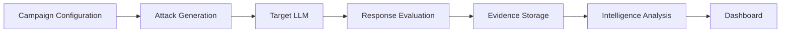
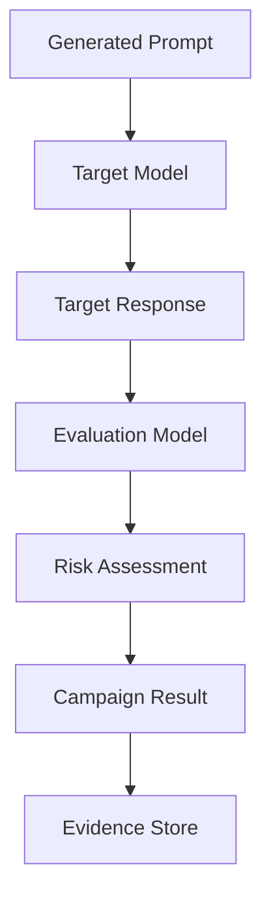
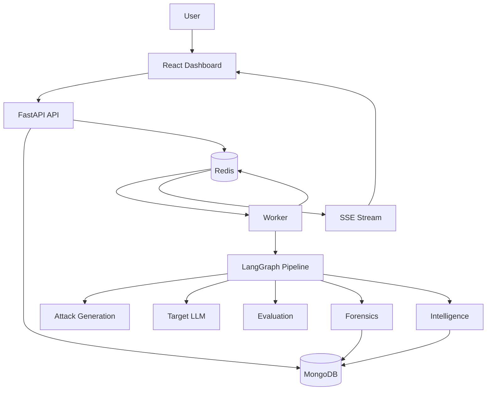
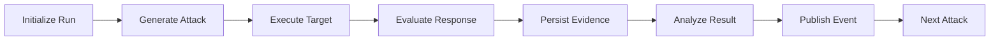
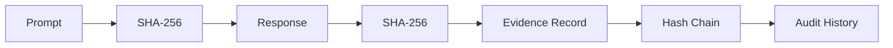
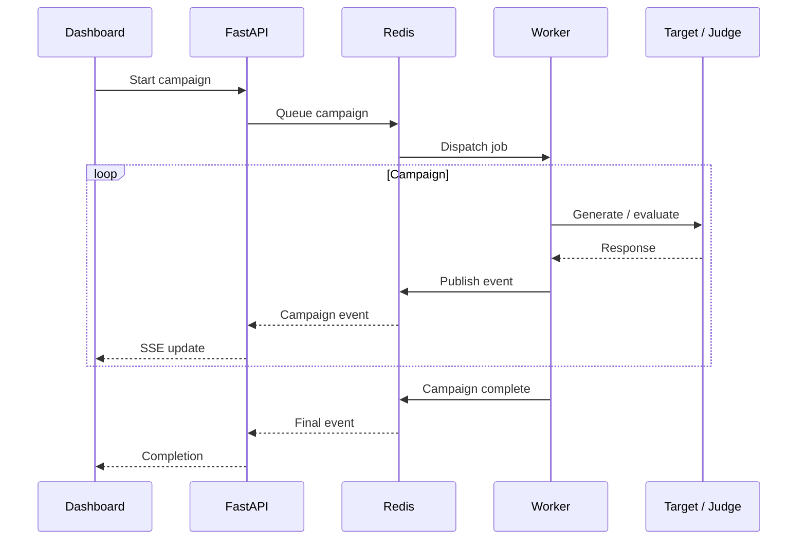

<div align="center">

<pre>
             ...                                                                                                        ...              
               -.                                                                                                      .-.               
               ..--. ..                                                                                          ....+...                
                ...+##---..                                                                                 . .-.-##+.-                  
                ..--##-- ..-.--+.-.                                                                  ...++-.-...+-##-..                  
                  ....- --.---.-. ..-...                                                         .-.....-.+....-......                   
                    . .+--..  .-... ..  ...                                                   .-.    ...- . ....-...                     
                     ..- .       .....   ..                                                ...    ....       ...+.-                      
                     ..-...        -.   . ...                                              .....  ..-        ..--- .                     
                      . -...  .     ... ....-.                                            -..... ..     .    ..-.                        
                     .  ..-.          . .  ...-                                          -... ....          .-.. .                       
                     .. ..    .... ...   ..... ..  ..                                 ...  ...    ..  ....    ....                       
                     ..-.-..      ....     ...-.......                           ........- ..     ....       ...-.                       
                  .    .....     .....   . ...  ..- ..-.                       . ..-.- .  .. .. ..-.. .     .--...  .-.                  
                  ...   -.         ...-...   .........-...                    ...-.........  .. ....         .... ....                   
                    ..-- .-... .   .  ...... ..........--+.....          .....+-.....-.... ... ... ..   .   .. .--....                   
                     .....-----.. ...   ..     ... .....+---...          ...----...... ..     ..  ..-....--.--....                       
                         --++#-.    .... .....  ........-###+...        ..-###+-.....- .  .........    ..-#----.                         
                          ...-...   ....  . ............-++++#..        ..#+##+-........... ..    . .. ...-..                            
                          . .  --.. .      .... .-.....--...---.        .-------....- -......  .  .....+.   .                            
                       .......  ..--..        .........-.--.-+.-       .---..-.+.-.--... .....       --...........                        
                        -....      . ..  ..  ..  ....-........+.-      .+-...-..-.-.- .  .. .-  ..  .     .-. .-.                        
                    ... .. ...      ..  ......    .....---.--.+-.     .-+..-+.-.-- .     .- ...  ..        ...  . -.                     
                     ...  ..-..........-...---....    .......-...-    .--......-.. .  . ..--.-...... .. ...- . ...-                      
                     . .-+#+--.---....        ............+..-...+ ..--.+...--........ .     .     ....-...-+++-..                       
                       ..---#+--....  ...    ....... .-.....-..--.-..-..-.-+........  ....       ..... .--++---..                        
                       ....+##--..-.  ...     -..........-.---++-......--+---...... ......    .. . . ....-##+...                         
                          ........ .     ..  ....-.+-+##-+-+++-.--+. ------++-+++#+--.... .        ............                          
                              .  .  .... .....-    . .--++..-..-----+---..--.-++--... . .-.... . ...  .                                  
                                              .. .-..--...-.----.-+.++------.........-...                                                
                                              .-... -.....--.--+#++ .##+------..........-..                                              
                                           .........- ..+--.--+-++...#++#--....+.. --........                                            
                                        . .-.............-....----....#----..--.... ..-.....+..                                          
                                     ...#-..-.........-..-.---+-. ... .--+----+..-..  .....-..+#..                                       
                                    ..#-.-.......--.....-.--+##.... .....##+----.....-...  ..--.+-.                                      
                                   ..---.... .-.-.......-++##+....     ...##+++-...... -.......----.                                     
                                 ...-##+-....--... .....-++#--...      ...-+#++-.-.... ..--....-###-...                                  
                                   +..-......-....-..-.--##-....       .....-#--..-..-...-- ..-..-.--                                    
                                  ..       ......--...-.-.....            .....---....-.....   .    ...                                  
                                 -.        .-. -+.-.-.... ..                ....--.....--.....       ..                                  
                                 .        .....--.#.-+..                       . .+..#.-... ..                                           
                                           .. .-.+-+....                        ...+--.-- . ..                                           
                                             .--#--..                            ....-+#+..                                              
                                             .-.-.                                  . .....                                              
                                             .##-                                     .+#-                                               
                                              ....                                    ....                                               
                                             .. .                                      ....                                               
                                             ...                                        ....
</pre>

<h1>Valerie</h1>

<p><b>LLM Red Teaming &amp; Safety Evaluation</b></p>

<p>
  An automated pipeline for generating adversarial prompts, evaluating LLM responses,
  detecting safety failures, and preserving evidence for analysis.
</p>

<br />

<a href="https://valerie-beta.vercel.app/">
  
</a>

<br />

</div>

---

## Overview

Valerie is a system for automated red teaming and safety evaluation of Large Language Models.

A campaign generates adversarial prompts, sends them to a target model, evaluates the resulting responses, and stores the evidence for later analysis.

The system combines:

* Adversarial prompt generation
* Multi-provider LLM routing
* Automated response evaluation
* Evidence hashing and integrity checks
* Campaign-level clustering
* Anomaly detection
* Risk visualization
* Real-time execution updates

The focus is on making LLM evaluations **repeatable, observable, and traceable** rather than treating a jailbreak attempt as an isolated prompt.

---

## How It Works

A Valerie campaign follows a pipeline from attack generation to analysis:



A campaign can be configured around a domain, attack strategy, target model, evaluation model, and concurrency.

The resulting run is persisted and streamed to the frontend while it executes.

---

## Attack Generation

Valerie uses adversarial prompting techniques to generate inputs intended to stress the target model's safety boundaries.

Prompt resources are organized by domain and stored under `resources/`.

The system supports domain-specific evaluation across areas such as:

* General
* BFSI
* Healthcare
* Pharmacy
* Legal
* HR
* Ecommerce

The attack generation layer is separated from the target model so that different attacker strategies and target models can be evaluated independently.

---

## Evaluation Pipeline

After an adversarial prompt is generated, Valerie sends it to the configured target model.

The response is then evaluated by the evaluation layer.



The evaluation stage tracks signals such as:

* Safety violations
* Prompt injection success
* Policy violations
* Risk level
* Evaluation confidence

Low-confidence results can be surfaced for further inspection rather than being treated as definitive.

---

## Campaign Architecture

Valerie separates request handling from long-running campaign execution.



This separation allows the API to remain responsive while the worker handles the expensive LLM evaluation workload.

---

## LangGraph Pipeline

The campaign workflow is represented as typed state and executed through LangGraph.

At a high level:



The graph keeps campaign state separate from the API layer and makes individual stages easier to retry, observe, and extend.

---

## Forensic Evidence

Valerie does more than store a final risk score.

Prompts and responses are hashed when they enter the forensic layer using SHA-256.

The resulting evidence can be linked into a hash chain so that modifications to previously recorded data can be detected.



The forensic layer tracks:

* Prompt hashes
* Response hashes
* Evidence provenance
* Chain relationships
* Audit events

This makes an evaluation finding inspectable instead of reducing it to a single database field.

---

## Intelligence Layer

Large campaigns can generate a significant number of individual results.

Valerie includes an analysis layer for identifying patterns across those results.

### Clustering

DBSCAN is used to group similar attack or response patterns without requiring the number of clusters to be known beforehand.

### Anomaly Detection

Isolation Forest identifies results that differ significantly from the rest of the campaign.

These outliers can be inspected separately for unusual model behavior.

### Risk Analysis

Campaign results can be aggregated into risk matrices and visualized through the dashboard.

This allows comparisons across:

* Attack techniques
* Domains
* Models
* Risk categories
* Campaigns

---

## Real-Time Execution

Campaign progress is streamed from the backend to the frontend using Server-Sent Events.



This allows the dashboard to show campaign progress without repeatedly polling the API.

---

## Dashboard

The frontend provides a visual interface for monitoring and investigating campaigns.

It includes:

* Campaign monitoring
* Attack-chain visualization
* Live execution updates
* Risk heatmaps
* Intelligence views
* Evaluation results

React Flow is used for graph-based visualizations, while Zustand manages frontend state.

---

## Security

Valerie includes several controls around the API and evaluation pipeline:

* API-key authentication
* Constant-time credential comparison
* Owner-based resource isolation
* Input validation
* Template sanitization
* Environment-based secret configuration
* Startup validation for missing configuration
* Rate-limiting infrastructure

Secrets should be supplied through environment variables and should never be committed to the repository.

---

## Reliability

Campaign execution involves external LLM APIs, so failures are expected.

The backend includes:

* Retry handling with exponential backoff
* Redis-based decoupling
* Worker separation
* Health endpoints
* Connection pooling
* Error tracking
* Dead-letter handling for failed tasks
* Graceful degradation paths

The goal is to prevent a single failed model request from taking down an entire campaign.

---

## Architecture Patterns

A few architectural decisions are central to Valerie.

### Event-driven execution

Redis separates API requests from campaign execution and provides a communication path between workers and consumers.

### Typed pipeline state

The LangGraph workflow uses typed state to make transitions between campaign stages explicit.

### Separate read and write paths

Campaign execution writes results while the dashboard primarily reads and streams those results.

### Confidence tracking

Evaluation confidence is retained so uncertain model judgments can be identified rather than hidden behind a binary result.

### Evidence-first design

The underlying prompt and response are retained alongside the evaluation instead of storing only the final classification.

---

## Project Structure

```text
valerie/
├── frontend/
│   ├── src/
│   │   ├── components/
│   │   ├── pages/
│   │   ├── stores/
│   │   └── hooks/
│   ├── Dockerfile.dev
│   └── package.json
│
├── src/
│   └── valerie/
│       ├── api/
│       ├── graph/
│       ├── forensics/
│       ├── intelligence/
│       ├── knowledge/
│       ├── learning/
│       ├── db/
│       ├── llm/
│       └── worker/
│
├── resources/
│   └── domain prompt datasets
│
├── docs/
│   └── architecture and design documents
│
├── deploy/
├── infra/
├── tests/
│
├── demo_simulator.py
├── seed_forensic_campaign.py
├── purge_db.py
├── docker-compose.yml
├── Dockerfile
├── DEMO_SETUP.md
├── requirements.txt
└── pytest.ini
```

---

## Technology Stack

| Layer               | Technologies                      |
| ------------------- | --------------------------------- |
| Backend             | Python, FastAPI, Uvicorn          |
| Agent orchestration | LangGraph                         |
| LLM integration     | LiteLLM, multiple model providers |
| Database            | MongoDB                           |
| Messaging           | Redis                             |
| Frontend            | React, TypeScript, Vite           |
| Styling             | Tailwind CSS                      |
| State management    | Zustand                           |
| Visualization       | React Flow                        |
| Streaming           | Server-Sent Events                |
| Analysis            | DBSCAN, Isolation Forest          |
| Infrastructure      | Docker, Docker Compose            |

---

## Getting Started

### Requirements

* Python 3.12+
* Node.js 20+
* Docker
* Docker Compose
* MongoDB 6+
* Redis 7+

---

### Demo Mode

The repository includes a demo configuration and simulator for running the dashboard with pre-populated campaign data.

```bash
git clone https://github.com/imshreyaskn/valerie.git
cd valerie

cp .env.demo .env

docker-compose up --build
```

Generate demo campaign data:

```bash
python demo_simulator.py
```

The default local services are:

```text
Frontend     http://localhost:5173
API          http://localhost:8080
Worker       http://localhost:8081
```

For the complete demo setup and troubleshooting instructions, see `DEMO_SETUP.md`.

---

### Development Setup

Clone the repository:

```bash
git clone https://github.com/imshreyaskn/valerie.git
cd valerie
```

Install backend dependencies:

```bash
pip install -r requirements.txt
```

Create the environment file:

```bash
cp .env.example .env
```

Configure the required database connections and model-provider credentials.

Start MongoDB and Redis:

```bash
docker-compose up mongodb redis
```

Start the API:

```bash
cd src

uvicorn valerie.api.main:app \
  --reload \
  --host 0.0.0.0 \
  --port 8080
```

Start the worker in a separate terminal:

```bash
uvicorn valerie.worker.executor:app \
  --host 0.0.0.0 \
  --port 8081
```

Start the frontend:

```bash
cd frontend

npm install
npm run dev
```

---

## Configuration

Copy the example environment file:

```bash
cp .env.example .env
```

The configuration includes values for:

* MongoDB connection
* Redis connection
* API authentication
* LLM provider credentials
* Application URLs
* Worker configuration
* Frontend/backend integration

Never commit the populated `.env` file.

---

## Example Campaign

A typical evaluation looks like:

```text
Campaign
   │
   ├── Domain: BFSI
   │
   ├── Attack Generation
   │       ├── Attack A
   │       ├── Attack B
   │       └── Attack C
   │
   ├── Target Model
   │       └── Response
   │
   ├── Evaluation
   │       ├── Risk
   │       └── Confidence
   │
   ├── Forensics
   │       ├── Prompt Hash
   │       └── Response Hash
   │
   └── Intelligence
           ├── Cluster
           └── Anomaly
```

The dashboard then exposes the resulting campaign state and analysis.

---

## Why The Forensic Layer Matters

A red-team result is only useful if the underlying evidence can be inspected.

Instead of storing:

```text
attack → failed
```

Valerie keeps the relationship between:

```text
attack
  ↓
prompt
  ↓
target response
  ↓
evaluation
  ↓
risk
  ↓
evidence
```

This makes it possible to go back from an observed failure to the exact interaction that produced it.

---

## Design Decisions

### Generation and evaluation are separate

The model responsible for generating an adversarial input does not have to be the same model responsible for judging the target response.

This allows different combinations of attacker, target, and judge models.

### Campaign execution is asynchronous

LLM calls can be slow and unreliable.

Moving campaign execution into a worker prevents long-running evaluations from blocking normal API requests.

### Evidence is stored with the result

A risk score without its underlying prompt and response is difficult to investigate.

The forensic layer keeps the raw interaction connected to the evaluation.

### Analysis happens at campaign level

Individual responses can be difficult to interpret in isolation.

Clustering and anomaly detection provide another level of analysis across the complete campaign.

---

## Current Scope

Valerie currently focuses on automated LLM safety evaluation through adversarial prompting.

The main implemented areas are:

* Campaign orchestration
* Adversarial prompt generation
* Target model execution
* Automated response evaluation
* SHA-256 evidence hashing
* Hash-chain verification
* Campaign intelligence
* Real-time SSE updates
* React-based visualization
* MongoDB persistence
* Redis-backed worker execution

The repository also contains knowledge and learning components intended to extend the evaluation loop over time.

---

## Lessons Learned

Building Valerie highlighted a different problem from building a normal LLM application.

Generating an adversarial prompt is only one part of the system.

The harder engineering problem is building the infrastructure around the experiment:

* How is the run represented?
* How are failures handled?
* How do we preserve the original evidence?
* How do we compare thousands of responses?
* How do we surface unusual results?
* How does the UI observe a long-running campaign?

That led to an architecture where **generation, execution, evaluation, evidence, and analysis are separate stages**.

---

## Live Application

[Valerie Dashboard](https://valerie-beta.vercel.app/)

---

<div align="center">

Built for experimenting with LLM safety, adversarial evaluation, and AI security.

</div>
